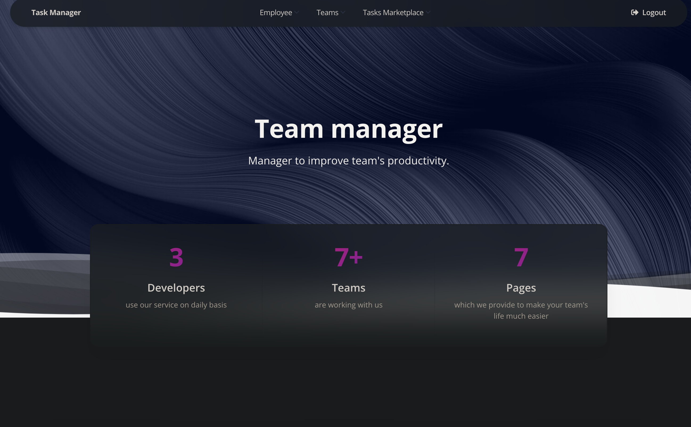

# Task manager
> Task manager and productivity tracker for teams

Django, Python 3.11

## Link
https://task-manager-ii5h.onrender.com

## Installing / Getting started

Run the code below at shell console

```shell
git clone https://github.com/VladyslavShepilov/task-manager
cd task-manager
python3 -m venv venv
source venv/bin/activate
pip install -r requirements.txt
python manage.py runserver
```

Installs requirements and runs django server.


```shell
packagemanager deploy awesome-project -s server.com -u username -p password
```

## Features

* Authentication for Users
* Admin panel for managing teams and employees
* Managing tasks though website interface
* Productivity tracker


## Demo

